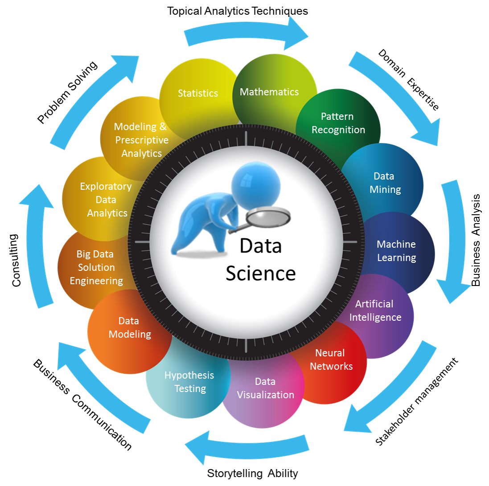

  
# Mi primer repositorio (para titulos)
## Introducción a la ciencia de datos
Mariana 

**Texto en negrita**
*cursiva*
***en negrita y cursiva***

<pre>
def hola():
  print("Hola")
</pre>
> esto es una cita

- Lista
- Otro  
  - Sub-ekemento

- [x] Tarea pendiente
- [ ] Tarea pendiente

| Nombre | Apellido| 
|--------|---------|
|Juan    |Rodriguez|
|Carlos  | Arisco  |

> [!WARNING]
> Prestar atencion

  
<Resumen> Haz click para desplejar mas info </Resumen>
Contenido oculto que se despliega 

La ecuación de Einstein es $E = mc^2$

$$
x=2^4 * y 
$$

.
.

